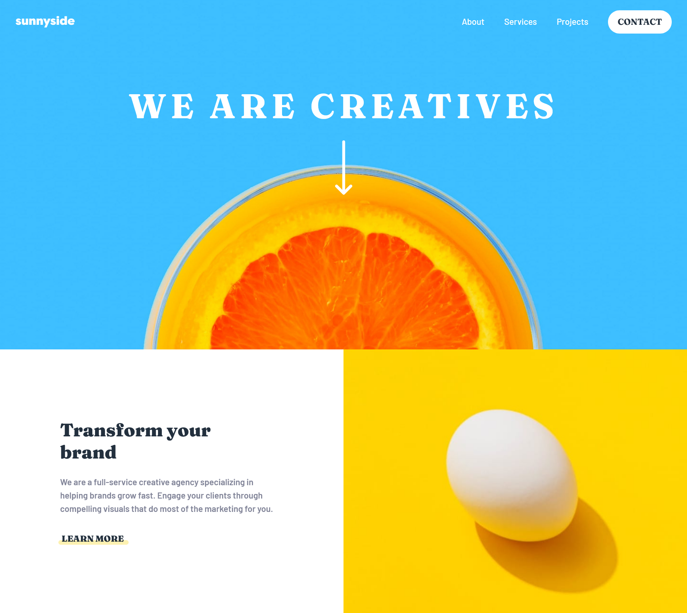

# Frontend Mentor - Sunnyside agency landing page solution

This is a solution to the [Sunnyside agency landing page challenge on Frontend Mentor](https://www.frontendmentor.io/challenges/sunnyside-agency-landing-page-7yVs3B6ef). Frontend Mentor challenges help you improve your coding skills by building realistic projects.

## Table of contents

- [Overview](#overview)
  - [The challenge](#the-challenge)
  - [Screenshot](#screenshot)
  - [Links](#links)
- [My process](#my-process)
  - [Built with](#built-with)
  - [What I learned](#what-i-learned)
  - [Continued development](#continued-development)
  - [Useful resources](#useful-resources)
- [Author](#author)


## Overview

### The challenge

Users should be able to:

- View the optimal layout for the site depending on their device's screen size
- See hover states for all interactive elements on the page

### Screenshot




### Links

- Solution URL: [Github solution](https://github.com/uvdevelop26/sunnyside-agency-landing-page)
- Live Site URL: [Add live site URL here](https://your-live-site-url.com)

## My process

### Built with

- Semantic HTML5 markup
- CSS custom properties
- Flexbox
- CSS Grid
- Mobile-first workflow


### What I learned

Positioning background images can be difficult, I learn this new CSS property called "background-position", which has many values that can help you position  your image in the right place

```css
.container-header {
    background: url(../images/mobile/image-header.jpg);
    background-size: cover;
    background-position: bottom 23% right 0px;
}

```

to change the color of the SVG images you have to give many values to the "filter" property

```css
.footer-logo-svg {
    filter: invert(90%) sepia(11%) saturate(961%) hue-rotate(109deg) brightness(92%) contrast(81%);
}

```


### Continued development

css grid is the key to succeeding in making beautiful layouts, mastering this technique still is the number one priority

### Useful resources

- [ChangeSVGcolor](https://codepen.io/sosuke/pen/Pjoqqp) --> this resource help me to generate the proper filter values to change the SVG colors


## Author

- Frontend Mentor - [@uvdevelop26](https://www.frontendmentor.io/profile/uvdevelop26)


